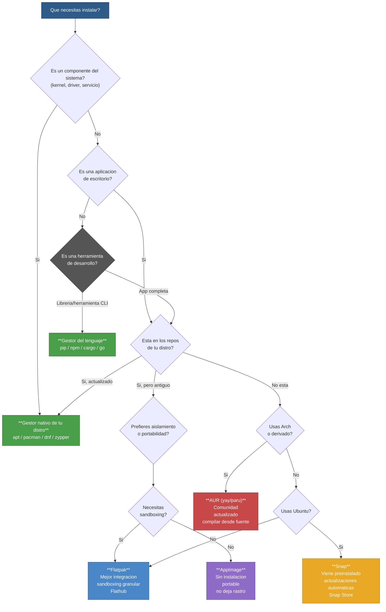

# Gestores de Paquetes

> Para la anatomía interna de cada formato de paquete (.deb, .rpm, .pkg.tar.zst, etc.), ver [[Formatos de Paquetes en GNU Linux]].

## Qué es

Un gestor de paquetes es el sistema que instala, actualiza y elimina software en Linux. Cada distro tiene su propio gestor, aunque los conceptos son los mismos entre todas.

## Comparativa por distro

| Distro base | Gestor | Bajo nivel | Formato | Actualizar | Instalar |
|---|---|---|---|---|---|
| **Debian/Ubuntu** | `apt` | `dpkg` | `.deb` | `apt update && apt upgrade` | `apt install <pkg>` |
| **Arch** | `pacman` | — | `.pkg.tar.zst` | `pacman -Syu` | `pacman -S <pkg>` |
| **Fedora/RHEL** | `dnf` | `rpm` | `.rpm` | `dnf upgrade` | `dnf install <pkg>` |
| **openSUSE** | `zypper` | `rpm` | `.rpm` | `zypper update` | `zypper install <pkg>` |
| **Alpine** | `apk` | — | `.apk` | `apk update && apk upgrade` | `apk add <pkg>` |

```bash
# Buscar paquetes
apt search <termino>        # Debian/Ubuntu
pacman -Ss <termino>        # Arch
dnf search <termino>        # Fedora

# Eliminar
apt remove <pkg>            # Debian/Ubuntu (usa apt purge para borrar config)
pacman -R <pkg>             # Arch (pacman -Rs para borrar dependencias no usadas)
dnf remove <pkg>            # Fedora
```

## Herramientas de bajo nivel (dpkg, rpm)

`apt`, `pacman`, `dnf` son **alto nivel**: resuelven dependencias automáticamente. Sus contrapartes de bajo nivel manejan paquetes individuales sin resolver dependencias.

### dpkg — Base del sistema Debian

Creado por Ian Jackson en 1993, `dpkg` es el sistema de gestión de paquetes de bajo nivel de Debian y sus derivados (Ubuntu, Mint, etc.). `apt` es el frontal de alto nivel que usa dpkg por debajo.

```bash
# Instalación y eliminación
dpkg -i paquete.deb             # instalar un .deb (falla si faltan dependencias)
dpkg -r <paquete>               # eliminar (pero deja archivos de configuración)
dpkg -P <paquete>               # purgar: eliminar todo, incluida la configuración

# Consultas
dpkg -l                         # listar todos los paquetes instalados
dpkg -l | grep <patrón>         # buscar paquetes instalados
dpkg -L <paquete>               # listar archivos que instaló un paquete
dpkg -S /ruta/al/archivo        # qué paquete instaló ese archivo
dpkg -s <paquete>               # estado y metadatos del paquete
dpkg --get-selections           # exportar lista de paquetes instalados

# Reconfigurar (vuelve a hacer preguntas de configuración)
sudo dpkg-reconfigure <paquete>
sudo dpkg-reconfigure debconf   # cambiar el modo de preguntas del instalador
```

#### El ecosistema dpkg

Debian incluye varias herramientas que acompañan a dpkg en el proceso de construcción de paquetes:

| Herramienta | Función |
|---|---|
| `dpkg-source` | Empaqueta/desempaqueta los fuentes de un paquete Debian |
| `dpkg-gencontrol` | Genera el archivo de control del paquete binario |
| `dpkg-shlibdeps` | Calcula dependencias de bibliotecas para ejecutables |
| `dpkg-genchanges` | Genera el archivo `.changes` con los cambios de versión |
| `dpkg-buildpackage` | Automatiza la construcción completa del paquete |
| `dpkg-parsechangelog` | Parsea el archivo `changelog` del paquete |

### rpm — Red Hat Package Manager

Originalmente **Red Hat Package Manager**, hoy es un acrónimo recursivo: **RPM Package Manager**. Es el formato base del Linux Standard Base (LSB). Usado por Fedora, RHEL, CentOS, openSUSE, Mageia y derivados. `dnf` y `zypper` son los frontales de alto nivel que lo utilizan.

```bash
# Instalación y eliminación
rpm -ivh paquete.rpm            # instalar (i=install, v=verbose, h=progress)
rpm -Uvh paquete.rpm            # actualizar (si no está instalado, lo instala)
rpm -Fvh paquete.rpm            # solo actualizar (no instala si no existe)
rpm -e <paquete>                # eliminar

# Consultas
rpm -qa                         # listar todos los paquetes instalados
rpm -qi <paquete>               # información detallada de un paquete
rpm -ql <paquete>               # listar archivos que instaló el paquete
rpm -qc <paquete>               # solo archivos de configuración
rpm -qd <paquete>               # solo archivos de documentación
rpm -qf /ruta/al/archivo        # qué paquete instaló ese archivo
rpm -q --whatrequires <paquete> # qué paquetes dependen de este

# Verificación y seguridad
rpm --checksig paquete.rpm      # verificar firma GPG del paquete
rpm -K paquete.rpm              # verificar firma (abreviado)
rpm -Va                         # verificar todos los paquetes instalados (útil para detectar archivos modificados)

# SRPMs (Source RPM) — paquetes con código fuente
rpm -i paquete.src.rpm          # instalar SRPM (pone los fuentes en ~/rpmbuild/)
```

#### Características avanzadas de RPM

- **Firmas GPG**: los paquetes pueden ir cifrados y verificados con GPG y MD5
- **SRPMs**: los archivos fuente se incluyen en paquetes `.src.rpm` para verificación y reconstrucción
- **DeltaRPMs**: parches que actualizan incrementalmente paquetes RPM ya instalados (ahorran ancho de banda)
- **Plugin para rpm**: existen plugins que añaden verificación de firmas, compresión distinta, etc.

```bash
# Ejemplo típico con SRPM:
# Descargar un SRPM, reconstruirlo para el sistema actual
rpm -i kernel.src.rpm
cd ~/rpmbuild/SPECS
rpmbuild -ba kernel.spec         # construir binario + SRPM
```

## AUR — Arch User Repository

El **AUR** (Arch User Repository) es un repositorio comunitario donde los usuarios de Arch Linux y derivados publican **PKGBUILDs** — recetas que describen cómo descargar, compilar y empaquetar software desde el código fuente. Es la razón clave por la que muchos eligen Arch: si un programa no está en los repos oficiales, casi seguro está en el AUR.

### Historia

| Período | Sistema | Descripción |
|---|---|---|
| **Inicios** | FTP incoming | Los usuarios subían PKGBUILD + paquete compilado al servidor FTP de Arch. Un mantenedor revisaba y adoptaba los paquetes |
| **~2008** | AUR 3.x | Se crea el repositorio web manejado por la comunidad. Aparecen los *Trusted Users* (TU) que supervisan y promueven paquetes |
| **2015** | AUR 4.0 | Migración a Git: cada PKGBUILD vive en su propio repositorio Git. Los paquetes antiguos se descartaron; los mantenedores migraron manualmente |
| **Actualidad** | AUR 4.x + Git | Más de 80,000 PKGBUILDs. Sistema de votación para promoción a *community* |

### Cómo funciona el flujo

```
Usuario escribe PKGBUILD → lo sube a AUR (Git) → comunidad vota →
si alcanza suficientes votos → Trusted User lo revisa →
se mueve al repositorio *community* → disponible via pacman directo
```

Los *Trusted Users* son miembros de confianza de la comunidad que:
- Supervisan los PKGBUILDs del AUR
- Marcan paquetes como seguros
- Promueven paquetes populares al repositorio *community*
- Mantienen la infraestructura de AUR

### PKGBUILD: el corazón del AUR

Un PKGBUILD es un script de Bash con variables y funciones que describen cómo construir el paquete:

```bash
# Ejemplo de PKGBUILD (para el paquete 'hello')
pkgname=hello
pkgver=2.12
pkgrel=1
pkgdesc="A familiar program that greets the user"
arch=('x86_64')
url="https://www.gnu.org/software/hello/"
license=('GPL3')
depends=('glibc')
source=(https://ftp.gnu.org/gnu/$pkgname/$pkgname-$pkgver.tar.gz)
sha256sums=('e2dc0a252be8c38cf0c8c9e8a4688cacdb0c2f76b5a65cbd0db83c2c5e6da1b1')

build() {
  cd "$srcdir"/$pkgname-$pkgver
  ./configure --prefix=/usr
  make
}

package() {
  cd "$srcdir"/$pkgname-$pkgver
  make DESTDIR="$pkgdir" install
}
```

### Ayudantes (helpers) AUR

Pacman solo funciona con los repositorios oficiales. Para instalar desde AUR se necesitan *helpers* que automatizan el proceso: descargar el PKGBUILD, verificar, compilar y empaquetar.

```bash
# Requisitos previos (cualquier helper)
sudo pacman -S --needed git base-devel

# yay — el más popular (Go)
git clone https://aur.archlinux.org/yay.git
cd yay && makepkg -si && cd ..

yay <paquete>                          # buscar e instalar desde AUR
yay -Syu                               # actualizar todo (oficial + AUR)
yay -Sua                               # actualizar solo AUR
yay -Yc                                # limpiar dependencias huérfanas
yay -G <paquete>                       # descargar PKGBUILD sin compilar (para inspeccionar)

# paru — alternativa moderna (Rust)
git clone https://aur.archlinux.org/paru.git
cd paru && makepkg -si && cd ..
paru -Syu                              # actualizar todo
paru --report                          # reporte de paquetes huérfanos
```

| Helper | Lenguaje | Ventajas |
|---|---|---|
| **yay** | Go | El más popular, interfaz similar a pacman, maduro |
| **paru** | Rust | Más rápido, integración nativa con pacman, reportes |
| **trizen** | Perl | Ligero, similar a pacman |
| **pikaur** | Python | Minimalista, seguro, sin dependencias externas |

### Buenas prácticas con AUR

1. **Revisa el PKGBUILD** antes de compilar: `yay -G paquete` lo descarga para inspeccionarlo
2. **Prefiere paquetes oficiales** sobre AUR — los oficiales tienen control de calidad
3. **Mantén limpio** con `yay -Yc` o `paru --report` para eliminar dependencias huérfanas
4. **No uses AUR como gestor principal** — usarlo para todo ralentiza el sistema (compila desde fuente)
5. **Actualiza con cuidado** — los PKGBUILDs son creados por la comunidad, no por los desarrolladores originales
6. **Presta atención a `sha256sums`** — si no coinciden, el PKGBUILD pudo ser manipulado

Ver [[Arch Linux]] y [[CachyOS]].

## Formatos portables (AppImage, Flatpak, Snap)

Los **formatos portables** (también llamados universales) resuelven el problema histórico de Linux: empaquetar software que funcione en **cualquier distribución** sin depender de apt, pacman, dnf o los repositorios específicos de cada distro.

A diferencia de los paquetes tradicionales (`.deb`, `.rpm`), los formatos portables encapsulan la aplicación **con todas sus dependencias**, eliminando conflictos entre versiones de librerías y garantizando que la app se vea y funcione igual en cualquier sistema.

```
┌─────────────────────────────────────────────────────────────────┐
│               Ecosistema de paquetes en Linux                     │
├───────────────────┬─────────────────────────────────────────────┤
│   Tradicionales    │         Portables / Universales              │
│   (ligados a       │         (funcionan en cualquier distro)      │
│    la distro)      │                                             │
├───────────────────┼──────────────┬──────────────┬───────────────┤
│   .deb → apt/dpkg  │   Flatpak    │   Snap       │   AppImage     │
│   .rpm → dnf/rpm   │   Flathub    │   Snap Store │   Descentral.  │
│   .pkg.tar.zst     │   Bubblewrap │   AppArmor   │   Sin sandbox  │
│       → pacman     │   OSTree     │   SquashFS   │   SquashFS     │
└───────────────────┴──────────────┴──────────────┴───────────────┘
```

---

### Comparativa general

| Aspecto | Flatpak | Snap | AppImage |
|---|---|---|---|
| **Creador** | freedesktop.org (Red Hat) | Canonical (Ubuntu) | Simon Peter (comunidad) |
| **Repositorio** | Flathub (comunitario) | Snap Store (Canonical) | Ninguno (directo desde cada proyecto) |
| **Licencia repositorio** | Abierto | Propietario | — |
| **Daemon requerido** | ❌ No (`flatpak --user`) | ✅ Sí (`snapd`) | ❌ No |
| **Root requerido** | ❌ No (`--user`) | ✅ Sí | ❌ No |
| **Sandboxing** | ✅ Sí (Bubblewrap) | ✅ Sí (AppArmor/seccomp) | ❌ No (permisos del usuario) |
| **Aislamiento** | Medio-alto (permisos granulares) | Alto (confinamiento estricto) | Ninguno |
| **Actualizaciones** | Por comando (`flatpak update`) | Automáticas forzadas | Manual (descarga) |
| **Rollback** | ✅ `flatpak info -c <app>` + `flatpak update --commit=<hash>` | ✅ `snap revert` | ❌ No |
| **Integración escritorio** | ✅ Automática (menú, .desktop) | ✅ Automática | ⚠️ Manual (AppImageLauncher) |
| **Canales** | Stable, beta | stable, candidate, beta, edge | No |
| **Instalación sin red** | No (descarga de Flathub) | No (descarga de Snap Store) | ✅ Sí (archivo listo) |
| **Múltiples versiones** | ⚠️ Parcial (solo última instalada) | ❌ Una sola | ✅ Sí (archivos separados) |
| **Tamaño base** | ~150 MB (runtime base) | ~200 MB (core) | 0 (cada app es autónoma) |
| **Tiempo arranque** | Rápido (<1s) | Lento (1-5s) | Medio (1-3s, montar SquashFS) |
| **Comparte dependencias** | ✅ Sí (runtimes compartidos) | ✅ Sí (core + snapd) | ❌ No (cada app incluye todo) |
| **Espacio en disco** | Optimizado (runtimes comunes) | Medio (core compartido) | Mayor (todo duplicado) |
| **Código abierto** | ✅ Completo | ⚠️ Parcial (store propietaria) | ✅ Completo |
| **Popular en** | Fedora, Linux Mint, SteamOS, Pop!_OS | Ubuntu, IoT | Distribución directa por devs |

---

### Comparativa de comandos

| Acción | Flatpak | Snap | AppImage |
|---|---|---|---|
| **Instalar** | `flatpak install flathub <id>` | `snap install <nombre>` | Descargar + `chmod +x` |
| **Buscar** | `flatpak search <termino>` | `snap find <termino>` | Buscar en web o AppImageHub |
| **Ejecutar** | `flatpak run <id>` | Ejecutar desde menu o terminal | `./app.AppImage` |
| **Actualizar todo** | `flatpak update` | `snap refresh` | Manual (re-descargar) |
| **Listar instalados** | `flatpak list` | `snap list` | `ls ~/Applications/` |
| **Desinstalar** | `flatpak uninstall <id>` | `snap remove <nombre>` | Eliminar archivo |
| **Ver info** | `flatpak info <id>` | `snap info <nombre>` | `file app.AppImage` |
| **Permisos** | `flatpak override` | `snap connections` | No aplica |
| **Limpiar** | `flatpak uninstall --unused` | `snap saved` (snapshots) | Eliminar manualmente |
| **Reparar** | `flatpak repair` | `snap remove --revision` | Re-descargar |

```bash
# Flatpak — el mas recomendado para apps de escritorio
flatpak install flathub org.gimp.GIMP
flatpak run org.gimp.GIMP
flatpak update
flatpak uninstall --unused

# Snap — preinstalado en Ubuntu, automatico
snap install spotify
snap refresh
snap revert spotify

# AppImage — portable, sin instalacion
wget https://github.com/AppImage/AppImageKit/releases/download/continuous/appimagetool-x86_64.AppImage
chmod +x app.AppImage
./app.AppImage
./app.AppImage --appimage-extract  # si FUSE no esta disponible
```

---

### Árbol de decisión (Mermaid)

> **Nota**: Si no ves el diagrama, verifica que Mermaid este habilitado en *Settings > Editor > Renderizadores > Diagramas Mermaid* (Obsidian lo soporta de forma nativa desde v1.0+). Este diagrama es una guia visual para elegir formato de paquete.



---

### Cuando usar cada uno

| Si buscas... | Recomendacion |
|---|---|
| Apps de escritorio para uso diario | **Flatpak** (mejor integracion, sandboxing granular) |
| Compatibilidad inmediata con Ubuntu | **Snap** (viene preinstalado en Ubuntu 16.04+) |
| Probar una app sin compromiso | **AppImage** (descargar y ejecutar, no deja rastro) |
| Aislamiento y seguridad | **Flatpak** (permisos controlados por el usuario) |
| Portabilidad en USB live | **AppImage** (un archivo, funciona en cualquier sitio) |
| Distribuir mi propia app | **Flatpak** (Flathub) + **AppImage** (descarga directa) |
| Entornos offline / sin red | **AppImage** (el archivo se puede transferir manualmente) |
| Servidores / IoT | **Snap** (actualizaciones automaticas, confinemento estricto) |
| Multiples versiones de la misma app | **AppImage** (cada version es un archivo separado) |

---

### Notas especificas de cada formato

Para informacion detallada de cada formato, ver las notas dedicadas:

- **[[Snap y Flatpak]]** — historia, instalacion, comandos avanzados, permisos, canales
- **[[AppImage]]** — creacion con linuxdeploy/appimagetool, AppDir, AppImageUpdate, troubleshooting

```bash
# Resumen rapido de instalacion de cada formato

# Flatpak (en cualquier distro)
sudo apt install flatpak                     # Debian/Ubuntu
sudo pacman -S flatpak                       # Arch
flatpak remote-add --if-not-exists flathub https://flathub.org/repo/flathub.flatpakrepo

# Snap (preinstalado en Ubuntu)
sudo apt install snapd                       # Debian
yay -S snapd                                 # Arch (AUR)
sudo dnf install snapd                       # Fedora
sudo ln -s /var/lib/snapd/snap /snap         # Fedora (necesario)
sudo systemctl enable --now snapd.socket

# AppImage (no requiere instalacion)
# Solo descargar .AppImage, hacer ejecutable y usar
```

### Distribuciones y su enfoque

| Distro | Formato portable por defecto | Notas |
|---|---|---|
| **Ubuntu** | Snap | Firefox, Store y otros snaps preinstalados |
| **Fedora** | Flatpak | Flatpak viene incluido, Flathub configurado |
| **Linux Mint** | Flatpak | Snap deshabilitado por decision del proyecto |
| **SteamOS** | Flatpak | Descubrir (KDE) usa Flatpak como backend |
| **Pop!_OS** | Flatpak | Pop!_Shop incluye soporte Flatpak nativo |
| **Debian** | Ninguno | Puedes instalar Flatpak o Snap manualmente |
| **Arch** | Ninguno | Todo esta en pacman/AUR; Flatpak/Snap son optativos |
| **openSUSE** | Flatpak | Soporte integrado en YaST |

---

### Buenas practicas con formatos portables

1. **No mezcles Flatpak y Snap para lo mismo**: elige uno como principal (Flatpak recomendado) y usa el otro solo si es necesario
2. **Prefiere tu gestor nativo para cosas del sistema**: apt/pacman/dnf para drivers, kernels, servicios; Flatpak/Snap/AppImage para aplicaciones de usuario
3. **Flatpak `--user`** sin root para juegos y apps personales
4. **AppImage en `~/Applications/`** + `export PATH="$HOME/Applications:$PATH"` en `.bashrc`
5. **Snap solo si usas Ubuntu o necesitas algo especifico de Snap Store**
6. **AppImage para probar**: cero compromiso, cero instalacion, solo borras el archivo

---

## Tradicionales vs Portables — Cuando usar cada ecosistema

Ambos ecosistemas coexisten en Linux y tienen fortalezas distintas. La clave no es elegir uno sobre el otro, sino saber **cuando usar cada uno**.

### Tabla comparativa general

| Aspecto | Tradicionales (apt, pacman, dnf) | Portables (Flatpak, Snap, AppImage) |
|---|---|---|
| **Dependencias** | Compartidas con el sistema (una libc, un openssl) | Encapsuladas (cada app lleva las suyas o usa runtimes) |
| **Tamaño instalacion** | Pequeno (dependencias ya instaladas) | Mayor (runtime base + app) |
| **Espacio en disco** | Optimizado (librerias compartidas) | Mayor (runtime + app por separado) |
| **Integracion sistema** | Total (drivers, kernel, servicios, themes GTK/Qt del sistema) | Parcial (sandbox limita acceso a configuracion del sistema) |
| **Seguridad** | Confianza en el mantenedor de la distro | Sandboxing (aislamiento por defecto) |
| **Actualizaciones** | Gestionadas por el mantenedor de la distro | Automaticas (Snap) o por comando (Flatpak) |
| **Disponibilidad** | Todo lo que empaqueta la distro | Apps de escritorio + algunas herramientas CLI |
| **Rollback** | Limitado (snapper en openSUSE, timeshift) | Nativo (snap revert, flatpak update --commit) |
| **Multiples versiones** | Dificil (una version por distro) | Posible (AppImage: archivos separados) |
| **Sin internet** | Funciona si el paquete ya esta cacheado | Flatpak/Snap requieren descarga; AppImage es portatil |
| **Aislamiento** | Ninguno (el paquete se integra al sistema) | Sandboxing (cada app corre aislada) |
| **Propietario** | No | Parcial (Snap Store es propietaria) |

### Cuando conviene usar gestores nativos

| Situacion | Motivo |
|---|---|
| **Drivers y kernel** | Deben compilarse contra el kernel exacto del sistema |
| **Servicios del sistema** (nginx, postgres, sshd) | Necesitan integracion con systemd, logs, permisos del sistema |
| **Librerias de desarrollo** | Comparten dependencias con otros paquetes del sistema |
| **Entornos de servidor** | Menor sobrecarga, control de versiones preciso |
| **Sistemas sin internet** | Los paquetes pueden cachearse y transferirse manualmente |
| **Personalizacion profunda** | Temas GTK/Qt, fuentes, cursores del sistema se aplican automaticamente |
| **Rendimiento maximo** | Sin capas extra de aislamiento (flatpak añade ~100ms de arranque) |
| **Software CLI/TUI** | Gestores nativos son mas rapidos para herramientas de terminal |

### Cuando conviene usar formatos portables

| Situacion | Formato | Motivo |
|---|---|---|
| **Apps de escritorio que no estan en repos** | Flatpak | Flathub tiene la mayoria de las apps modernas |
| **Aislar aplicaciones del sistema** | Flatpak | Sandboxing granular, permisos controlados |
| **Usas Ubuntu y quieres compatibilidad** | Snap | Viene preinstalado, actualizaciones automaticas |
| **Probar una app sin instalarla** | AppImage | Descargar y ejecutar, no deja rastro |
| **Distribuir tu propia app** | Flatpak + AppImage | Flathub para descubrimiento, AppImage para descarga directa |
| **Multiples versiones de la misma app** | AppImage | Cada version es un archivo separado |
| **Entornos restringidos (sin root)** | Flatpak + AppImage | Ambos pueden funcionar sin permisos de root |
| **CI/CD y contenedores** | Snap | Actualizaciones atomicas, ideal para IoT/edge |

### En la practica: recomendacion general

```
┌─────────────────────────────────────────────────────────────────┐
│                 ESTRATEGIA RECOMENDADA                            │
├─────────────────────────────────────────────────────────────────┤
│                                                                   │
│  Sistema operativo (kernel, drivers, servicios):                  │
│  → Gestor nativo (apt / pacman / dnf)                             │
│                                                                   │
│  Aplicaciones de escritorio:                                      │
│  → Flatpak (recomendado) o Snap (si usas Ubuntu)                  │
│                                                                   │
│  Probar sin compromiso:                                           │
│  → AppImage                                                       │
│                                                                   │
│  Desarrollo (librerias, CLIs):                                    │
│  → Gestor nativo + pip/npm/cargo/gem/go                           │
│                                                                   │
└─────────────────────────────────────────────────────────────────┘
```

### Ejemplo practico: Firefox

| Distro | Opcion nativa | Opcion portable | Recomendacion |
|---|---|---|---|
| **Ubuntu 24.04** | `apt install firefox` (instala snap) | `flatpak install flathub org.mozilla.firefox` | Flatpak (evita el snap de Firefox, sandboxing) |
| **Fedora 40** | `dnf install firefox` | `flatpak install flathub org.mozilla.firefox` | Nativo (dnf, ya viene actualizado) |
| **Arch Linux** | `pacman -S firefox` | `flatpak install flathub org.mozilla.firefox` | Nativo (pacman, mas rapido y actualizado) |
| **Debian Stable** | `apt install firefox` (version ESR antigua) | `flatpak install flathub org.mozilla.firefox` | **Flatpak** (Debian tiene Firefox ESR muy viejo) |
| **Linux Mint** | No tiene Firefox en repos | `flatpak install flathub org.mozilla.firefox` | Flatpak (unica opcion sensata) |

```bash
# Comparativa de espacio (Firefox en Debian):
# Nativo (apt): ~150 MB
# Flatpak:     ~350 MB (incluye runtime)
# Snap:        ~400 MB (incluye core)
# AppImage:    ~200 MB (autonomo, no comparte nada)
```

### Verificacion rapida: que gestor usar segun tu distro

```bash
# Si usas Ubuntu/Debian:
#  apt  → sistema, servidores, librerias
#  flatpak → apps de escritorio
#  snap  → solo si viene preinstalado y no hay alternativa

# Si usas Arch/derivados:
#  pacman → todo lo que este en los repos
#  yay/paru → AUR si no esta en pacman
#  flatpak → apps de escritorio que prefieras aisladas

# Si usas Fedora:
#  dnf → sistema, servidores, librerias
#  flatpak → apps de escritorio (viene por defecto)

# Si usas openSUSE:
#  zypper → sistema
#  flatpak → apps de escritorio
```

## Gestores de plugins/programacion

| Herramienta | Para que |
|---|---|
| `pip` | Paquetes de Python (`pip install requests`) |
| `npm` | Paquetes de Node.js (`npm install express`) |
| `cargo` | Paquetes de Rust (`cargo install bat`) |
| `gem` | Gems de Ruby |
| `go install` | Binarios de Go |

## Por que importa

- Saber que gestor usa tu distro es el primer paso para instalar **cualquier cosa**.
- Diferenciar apt de dpkg, o pacman de yay, evita errores ("el paquete no se encuentra" cuando esta en el AUR, o "dependencias rotas").
- Entender Flatpak/Snap/AppImage te permite instalar software que no esta en tus repos oficiales.
- Elegir el ecosistema correcto para cada caso ahorra espacio en disco, mejora la seguridad y evita conflictos.

## Notas personales
-

## Ver tambien

- [[Shells (bash zsh fish)]]
- [[Que es Linux]]
- [[Editores de Texto]]

#instalacion #paquetes
